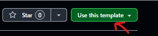

# React + Vite + TailwindCSS

This template provides a minimal setup to get React working in Vite.
I also included tailwindcss and added some colors in the tailwind.config to remember how to add custom colors 😅

Find the option to use it as a template at the top right of the repo to save time setting up a new project.

